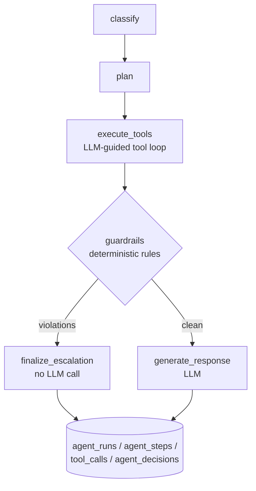

# ResolveAI — Evaluation-Driven Customer Operations Agent

[](https://github.com/jaiminpanchal2002/resolve-ai-agent/actions/workflows/ci.yml)
[](https://codecov.io/gh/jaiminpanchal2002/resolve-ai-agent)
[](https://opensource.org/licenses/MIT)

A production-oriented AI agent for investigating customer support cases using
tool calling, hybrid retrieval, deterministic policy guardrails, and offline
evaluation. Every agent action — each graph node, LLM call, and tool invocation —
is audited to PostgreSQL with token counts, cost, and latency.

## Architecture

The agent is a LangGraph `StateGraph` with a conditional guardrail edge: when a
deterministic compliance rule fires (e.g. a refund above ₹50,000, or a
high-value delivery dispute with missing proof of delivery), the run bypasses
the final LLM call entirely and escalates in code — the model can never talk
its way past a guardrail, and every guardrail hit saves one LLM round-trip.



Retrieval is hybrid: pgvector cosine similarity (HNSW index) fused with
Postgres full-text search (GIN index) via Reciprocal Rank Fusion, optionally
reranked by a cross-encoder (`ms-marco-MiniLM-L-6-v2`). Keeping vectors and
relational metadata in one PostgreSQL instance enables metadata filtering and
similarity search in a single query.

## Stack

Python 3.12 · FastAPI · Pydantic v2 · SQLAlchemy 2 · Alembic · PostgreSQL +
pgvector · Redis · Celery · LangGraph · OpenAI/Gemini provider abstraction
(with retries, timeouts, per-model cost table, and an explicit deterministic
fake mode for CI) · pytest + Testcontainers · Docker Compose · GitHub Actions ·
OpenTelemetry · Prometheus.

## Quickstart

```bash
cp .env.example .env        # add your OPENAI_API_KEY or GEMINI_API_KEY
docker compose up -d --build
make seed                   # lookup tables + synthetic customers/orders/policies
```

This starts PostgreSQL (pgvector), Redis, the FastAPI API (`:8000`), a Celery
worker, the React operator dashboard (`:5173`), and Prometheus (`:9090`).
Migrations run automatically on API startup. API docs: http://localhost:8000/docs

No API key? Run everything offline with the deterministic fake provider:

```bash
USE_FAKE_LLM=true docker compose up -d --build
```

## Testing

```bash
make test-unit          # unit + contract tests, no containers needed
make test-integration   # spins up ephemeral pgvector + Redis via Testcontainers
make test               # everything
```

Test layout: `tests/unit` (guardrails, RRF, classifier, pricing),
`tests/integration` (Postgres, vector search, agent tools, ticket API),
`tests/contract` (LLM structured-output schema conformance), `tests/e2e`
(full ticket resolution). CI runs lint → unit/contract → integration on
every push.

## Evaluation

The evaluation dataset lives in the repo (`scripts/eval_cases.json` — 15
hand-written cases including guardrail boundary cases at ₹49,999 / ₹51,000).

```bash
make eval               # runs the agent on every case, stores results in
                        # evaluation_runs / evaluation_results, prints metrics
```

Measured: resolution accuracy, category accuracy, guardrail compliance,
per-ticket latency and cost. Current results: see
[docs/evaluation_report.md](docs/evaluation_report.md) — numbers there are
only ever produced by `scripts/run_evaluation.py`, never written by hand.

## Repository layout

```
├── .github/workflows/ci.yml    # lint → unit/contract → integration
├── src/resolveai/
│   ├── api/                    # FastAPI routers (tickets, reviews, evals, auth)
│   ├── agent/                  # LangGraph StateGraph, tools, guardrails
│   ├── services/               # hybrid retrieval (RRF + cross-encoder)
│   ├── core/                   # config, auth, LLM providers, pricing
│   ├── models/                 # SQLAlchemy 2 tables (incl. full audit trail)
│   ├── schemas/                # Pydantic v2 request/response models
│   ├── tasks/                  # Celery background tasks
│   ├── db/                     # session management, seeding
│   └── main.py                 # app entrypoint, Prometheus + OpenTelemetry
├── tests/                      # unit / integration / contract / e2e
├── alembic/                    # migrations (incl. HNSW + GIN search indexes)
├── scripts/                    # seed_data.py, eval_cases.json, run_evaluation.py
├── frontend/                   # React operator dashboard (Vite)
├── docs/                       # architecture notes, evaluation report
└── docker-compose.yml          # postgres, redis, api, worker, frontend, prometheus
```

## Design decisions

- **Guardrails are code, not prompts.** Compliance limits run as plain Python
  after tool execution; a conditional graph edge routes violations to a
  deterministic escalation node.
- **Structured outputs everywhere.** Classification and tool selection use
  Pydantic models with Enums — invalid categories fail validation instead of
  slipping through as strings.
- **Auditability first.** `agent_runs`, `agent_steps`, `tool_calls`, and
  `agent_decisions` record every action with tokens, estimated cost (per-model
  pricing table), and latency.
- **Honest testing seams.** The fake LLM provider is selected only by explicit
  configuration (`USE_FAKE_LLM=true`), never silently in production code.

## License

MIT
