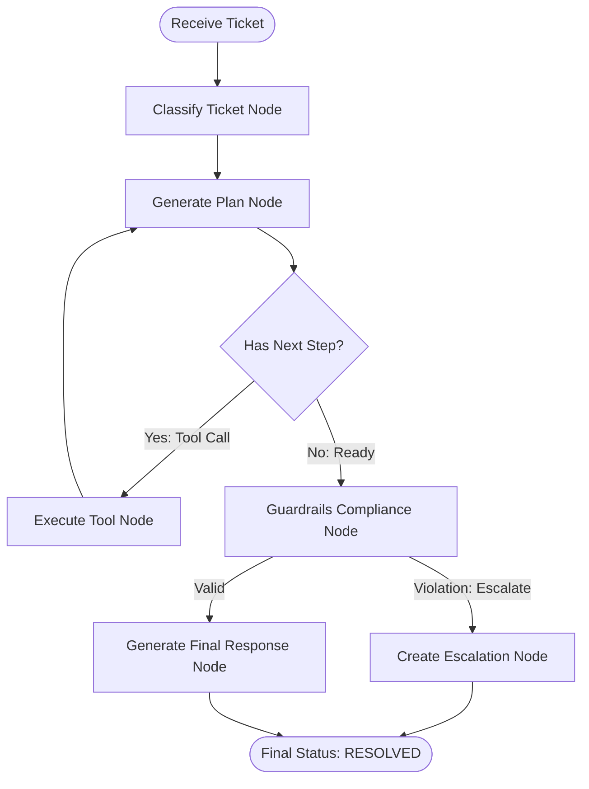

# ResolveAI — Agent Architecture

This document describes the LangGraph state machine workflow that orchestrates the ResolveAI Customer Operations Agent.

## Workflow Diagram

## Node Descriptions

### 1. Classify Ticket Node
* **Purpose**: Identifies the customer's intent, category, and severity from the ticket metadata and history.
* **Outputs**: `TicketClassification` schema containing category (e.g. `DELIVERY_DISPUTE`, `REFUND_REQUEST`), severity (`LOW`, `MEDIUM`, `HIGH`), and predicted intent (e.g., `REPORT_MISSING_DELIVERY`).

### 2. Generate Plan Node
* **Purpose**: Analyzes the classification and context to decide the next step.
* **Outputs**: Returns a structured tool call or determines that it has sufficient information to resolve the ticket.

### 3. Execute Tool Node
* **Purpose**: Dynamically invokes the requested backend database operation or retrieval service tool.
* **Available Tools**:
  * `get_customer`: Fetches customer profiles and loyalty tiers.
  * `get_order`: Retrieves order item and shipping status details.
  * `get_payment`: Checks transaction statuses and payment processor gateway logs.
  * `get_shipment`: Locates tracking events and signature proofs.
  * `search_policy`: Performs Hybrid RAG (semantic + FTS) over internal corporate refund/shipping guidelines.
  * `create_refund_request`: Files a refund request in the financial ledger.
  * `create_escalation`: Generates an escalation request to human operational queues.

### 4. Guardrails Compliance Node
* **Purpose**: Enforces deterministic guardrails over the draft decision (e.g., checks if a refund amount exceeds the auto-approval threshold of ₹50,000, or if proof of delivery is required but missing).
* **Behavior**: If a violation is flagged, it intercepts the agent and routes the state to an immediate human queue escalation.

### 5. Generate Final Response Node
* **Purpose**: Formulates the final response to the user, citing specific corporate policy rules and order database records.
